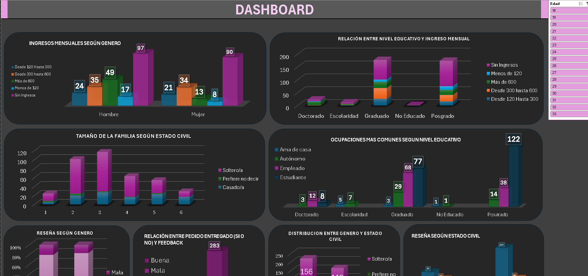

# <h1 align="center">_Analisis Local De Comida Online EXCEL_</h1>

  

## Descripción

Este proyecto se enfoca en el análisis de un dataset de pedidos online, abarcando aspectos demográficos de los clientes, sus ocupaciones, ingresos y el estado de los pedidos. Se realizó una limpieza de datos y segmentación para identificar patrones en el comportamiento de los clientes, la relación entre sus reseñas y la entrega de pedidos, y cómo el nivel educativo y el estado civil influyen en el feedback. Todo esto fue realizado utilizando Microsoft Excel como herramienta principal de análisis.

## **Características del Proyecto**

1. **Análisis de Pedidos Online**  
   Exploración de un dataset con información detallada sobre clientes, pedidos y su estado.

2. **Segmentación Demográfica y de Ingresos**  
   Estudio de las relaciones entre género, estado civil y nivel educativo con los ingresos de los clientes.

3. **Impacto del Tamaño Familiar en Opiniones**  
   Análisis de cómo el tamaño del hogar influye en la satisfacción del cliente y las reseñas proporcionadas.

4. **Estado de los Pedidos y Feedback**  
   Evaluación de la correlación entre la entrega de pedidos y la recepción de feedback positivo o negativo.

5. **Relación entre Ocupación y Nivel Educativo**  
   Identificación de patrones entre las ocupaciones más comunes y el nivel educativo de los clientes.

6. **Técnicas de Análisis de Datos**  
   Uso de tablas dinámicas, limpieza de datos y transformación de valores en Excel.

7. **Interpretación de Resultados**  
   Generación de insights clave sobre el comportamiento de los clientes en función de los ingresos, estado civil y educación.

8. **Visualización de Datos en Excel**  
   Creación de gráficos y tablas dinámicas para presentar hallazgos de manera clara y visualmente atractiva.

9. **Conclusiones**
   Conclusiones del estudio realizado.

## Tecnologias

- **EXCEL**

## Vista Previa

  

## Colaboradores

|                         | Nombre   || GitHub & LinkedIn                                                                                                                                                                                          |
| ----------------------------- | -------- | ---------------------- | ------------------------------------------------------------------------------------------------------------------------------------------------------------------------------------------------------- |
|  | Tomas Berni | |                           |                        |
|                               |
